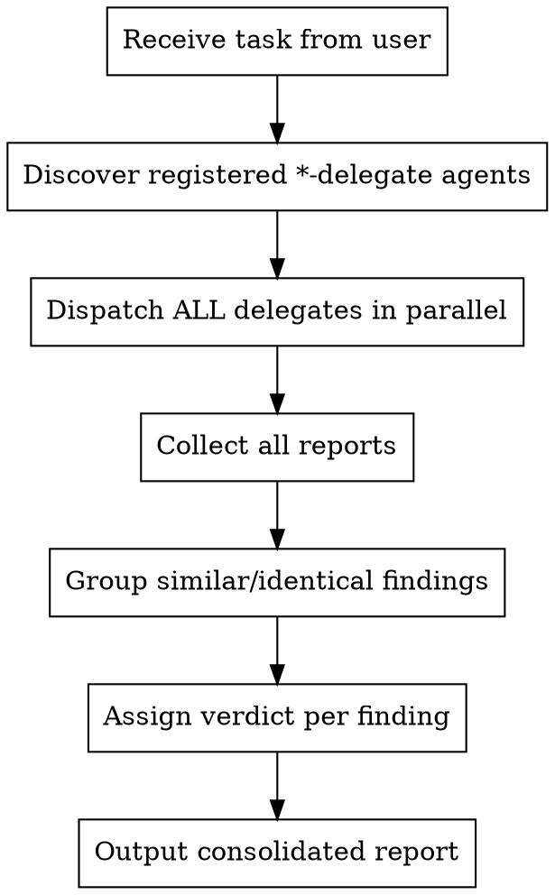

# Multi-Delegate

Dispatch a task to multiple independent subagents on different models in parallel, collect results, cross-analyze, produce a consolidated report.

## When to Use

- User explicitly asks for multi-delegate / multi-model analysis
- User wants cross-validation of findings from different AI models
- Tasks like code review, architecture analysis, security audit where multiple perspectives add value

## Registered Agents

The multi-delegate plugin dynamically creates `@*-delegate` agents from `~/.config/opencode/multi-delegate.jsonc` (or `$OPENCODE_CONFIG_DIR/multi-delegate.jsonc`):

```jsonc
{
  "delegate_models": [
    { "model": "anthropic/claude-opus-4-6" },
    { "model": "openai/gpt-5.4" },
    // "variant" is optional — only set when model has explicit variant definitions
    { "model": "google/gemini-3.1-pro-preview", "variant": "medium" }
  ]
}
```

Agent names are derived from model IDs: `anthropic/claude-opus-4-6` → `@anthropic_claude-opus-4-6-delegate`. Add or remove entries to change the delegate set. The `variant` field is optional — omit it to use provider defaults.

## Process



### Step 1: Dispatch

Discover all registered `*-delegate` agents and send the SAME task to ALL of them **in parallel**:

```
@anthropic_claude-opus-4-6-delegate <full task text>
@openai_gpt-5.3-codex-delegate <full task text>
@google_gemini-3.1-pro-preview-delegate <full task text>
... (however many are configured)
```

Do NOT modify or summarize the task. Pass the user's request as-is plus any relevant context (file paths, branch, scope).

### Step 2: Collect

Wait for all delegates to return. Each returns a list of findings in structured format.

### Step 3: Analyze

For each finding across all reports:

1. **Group** — match findings that describe the same issue (even if worded differently)
2. **Attribute** — note which delegates reported it
3. **Verdict**:
   - ✅ **confirmed** — 2+ delegates agree AND argumentation is valid
   - ⚠️ **disputed** — only 1 delegate claims it, OR arguments contradict each other
   - ❌ **rejected** — argumentation doesn't hold up, others explicitly refute, or clear hallucination

### Step 4: Output

Use this format for the consolidated report:

```
## Multi-Delegate Report

### Finding #1: [Title]

**Description:** [Detailed description — what was found, where,
why it matters. File paths, line numbers, context.]

**Severity:** critical | important | minor | info

**Recommendations:**
- [Concrete action 1]
- [Concrete action 2]

**Claimed by:** opus, codex, gemini (or subset)

**Orchestrator verdict:** ✅ confirmed / ⚠️ disputed / ❌ rejected
[1-3 sentences — WHY this verdict. If disputed or rejected,
explain what's wrong with the argumentation.]

---

### Finding #2: [Title]
...

---

## Consensus
[What all three agree on]

## Disagreements
[Where opinions diverged and why]

## Final Recommendation
[Your synthesized conclusion]
```

## Red Flags

- **Do NOT** skip any delegate's findings — every finding must appear in the report
- **Do NOT** blindly trust majority — 2 models agreeing on a hallucination is still a hallucination
- **Do NOT** add your own findings — you are an analyst of their reports, not a fourth reviewer
- **Do NOT** run delegates sequentially — always dispatch in parallel
- **Do NOT** modify the task before sending to delegates — pass it as-is
